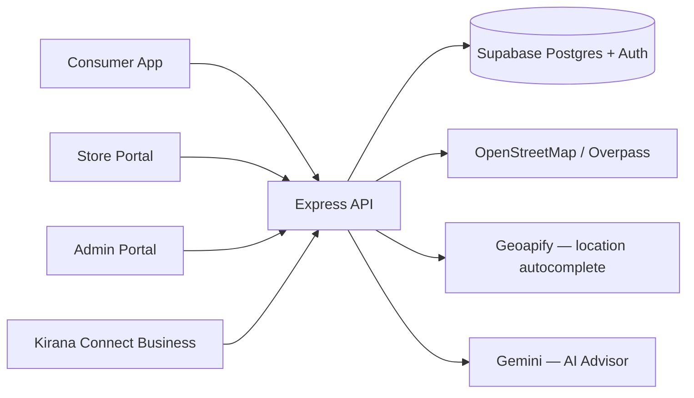

# Kirana Connect

A working prototype that helps a first-time entrepreneur decide *where* and *what* to sell, using
real nearby-store data — while also helping shoppers find and reserve products at the kirana
stores that actually stock them.

## Live Prototype

> **Kirana Connect is a working multi-portal prototype connecting consumers,
> local stores, entrepreneurs, and administrators through one ecosystem.**

| Platform | Live Demo |
| --- | --- |
| Kirana Connect — Main Portal | https://kirana-connect-portal.vercel.app |
| Consumer Platform | https://kirana-connect-one.vercel.app |
| Store Portal | https://kirana-connect-store.vercel.app |
| Admin Portal | https://kirana-connect-admin.vercel.app |
| Kirana Connect Business | https://kirana-connect-portal.vercel.app/entrepreneur |

**Backend:** Render  
**Database & Authentication:** Supabase

> Evaluator credentials are available in the [Evaluator Demo](#evaluator-demo) section.

## Problem

First-time, rural, and marginalized entrepreneurs can access government concessional finance
(margin ~10%, agency finance up to ~90% under two scheme tiers) but usually have no localized
market intelligence or financial literacy support to decide *where* to open a shop, *what* to
stock, or *how* the numbers actually work out. Existing tools either give generic business advice
with no local grounding, or require expertise the target entrepreneur doesn't have.

## Our Solution

Four connected surfaces, one Express API, one Supabase database:

- **Consumer Platform** — shoppers search for products, compare real nearby-store prices, and
  reserve an item for pickup (no delivery, no cart, no payment).
- **Store Portal** — kirana owners digitize their inventory, prices, and stock state, and manage
  incoming reservations.
- **Kirana Connect Business** — an entrepreneur enters a location, business category, and
  available margin, and gets a market + financing report grounded in the platform's own data,
  explained by a multilingual AI advisor.
- **Admin Portal** — governs the catalogue, approves stores, and manages the category taxonomy
  that ties all of the above together.

## Why Kirana Connect Is Different

The four surfaces aren't independent — they feed one data flywheel:

**Consumer demand** (real searches) **+ Store supply** (real inventory) **+ local market data**
(competitor mapping, price observations) **+ deterministic finance** (the actual SIH scheme
parameters) **+ grounded multilingual AI** (explains, never invents) = a market report an
entrepreneur can actually trust, because every number in it traces back to something real or is
honestly labeled as unavailable.

This is not a delivery platform. There is no cart, no checkout, no payment processing anywhere in
the codebase.

## Live Architecture



Every privileged write goes through the Express API using a service-role Supabase client that
never reaches the browser. All four frontends use only the Supabase anon key, and only for
authentication.

## Applications

| App | Purpose | Code location | Dev port | Production URL | Status |
| --- | --- | --- | --- | --- | --- |
| Consumer | Search, compare, reserve | repository root | 5173 | kirana-connect-one.vercel.app | Working prototype |
| Store Portal | Inventory, reservations | `apps/store` | 5174 | kirana-connect-store.vercel.app | Working prototype |
| Admin Portal | Catalogue/store governance | `apps/admin` | 5175 | kirana-connect-admin.vercel.app | Working prototype |
| Kirana Connect Business | Entrepreneur advisory | `apps/portal` | 5176 | kirana-connect-portal.vercel.app | Working prototype |
| Express API | Shared backend | `server` | 5000 | Render | Working prototype |

Confirm each production URL is actually serving the current build before an evaluator demo —
Vercel project settings (Git connection, production branch, root directory) can drift out of sync
with what's in this repository; see `docs/EVALUATOR_RUNBOOK.md`'s pre-demo checklist.

## Problem Statement Traceability

33 of 37 audited PS requirements PASS, 2 PARTIAL, 1 not implemented (operational cost planner —
the narrower Working Capital Planner is implemented), 1 not required (government datasets — none
are integrated, and the platform never claims otherwise). Full requirement-by-requirement matrix
with code citations: [docs/PS_TRACEABILITY_MATRIX.md](docs/PS_TRACEABILITY_MATRIX.md). Full audit
report with executed test results: [docs/FINAL_EVALUATION_REPORT.md](docs/FINAL_EVALUATION_REPORT.md).

| Area | Status |
| --- | --- |
| Entrepreneur inputs (location, margin, category) | PASS |
| Micro Finance & Term Loan scheme math, including exact boundaries | PASS (verified by direct execution) |
| Repayment schedule, moratorium handling | PASS (verified — labeled illustrative, never official) |
| Operational cost planner | NOT IMPLEMENTED (Working Capital Planner exists instead) |
| Market Reach | PARTIAL (geography real; population honestly unavailable) |
| Demand/supply, competitor mapping, local price intelligence | PASS |
| Opportunity Score, SWOT, threats | PASS (evidence-gated, weights documented in code) |
| Multilingual AI advisor (English/Bengali/Hindi), grounded | PASS |
| Product reservation, last-unit concurrency safety | PASS (verified: race, cancel, expire, collect) |

## Consumer Platform

- Product search with live results, category browsing, and location-aware store discovery.
- Side-by-side price comparison across every participating store stocking a product — each
  store's own price, discount, distance, and stock state.
- "Go to store" opens walking directions. No delivery, no cart, no payment anywhere.
- Product reservation (below) for stores that track exact stock.

## Product Reservation

**This is not ordering or payment.** A reservation is a temporary hold on one store's physical
inventory so a customer can walk in and collect it — nothing more.

- `availableQuantity = max(physical stock − active unexpired reservations, 0)`. An expired
  reservation stops counting the instant it passes its expiry time, whether or not any cleanup
  job has run — correctness never depends on a scheduled job.
- Creation is atomic (`SELECT ... FOR UPDATE` inside a Postgres function): two simultaneous
  reservation attempts for the last unit can never both succeed. Verified this audit with a real
  concurrent-request test — one 201, one conflict, every time.
- A `KC-####` code is generated for pickup verification. **It is not authorization** — it's a
  four-digit code the customer states at the counter; store staff must type it back to confirm
  collection, and it is deliberately never shown in the store's own reservation list.
- Pickup window: the customer picks a start/end time (max 6 hours); `expires_at` is computed
  server-side as pickup-window-end + 1 hour — never trusted from the client.
- Full lifecycle — reserve, cancel/release, automatic expiry, collection (which is the only
  operation that ever decrements physical stock) — is covered by an automated test run this audit
  (14/14 assertions passed).

## Store Portal

- Store onboarding with admin approval before a store becomes publicly visible.
- Inventory management: price, stock status, exact quantity (optional — reservations only work
  for items with a tracked exact quantity).
- Reservation list and pickup-code verification, scoped strictly to the signed-in owner's own
  store.

## Admin Portal

- Store application review (approve/reject), catalogue (products, categories, brands)
  management, business-category taxonomy and product-category mapping, homepage mood-card image
  management.
- Every `/api/admin/*` route requires a verified Supabase token *and* a trusted
  `profiles.role = 'admin'` resolved server-side — never trusted from the client.

## Kirana Connect Business

Input: a location (village/block/district or equivalent), an available margin, and a business
category. Output, across four tabs:

- **Overview** — the Opportunity Score and its methodology, in plain language.
- **Market** — Demand & Supply Gap, Competitor Mapping, Local Product Market Value.
- **Finance** — the matched scheme, funding gap, illustrative repayment schedule, and a Working
  Capital Planner.
- **Risks & SWOT** — every item carries a named evidence source; empty categories say so honestly
  rather than being padded with generic advice.
- **AI Advisor** — explains the report above in English, Bengali, or Hindi.

## Financial Engine

A pure, deterministic module (`apps/portal/src/features/entrepreneur/financialEngine.js`) — no AI
involved anywhere in this calculation.

| Parameter | Micro Finance | Term Loan |
| --- | --- | --- |
| Project cost band | up to ₹1,40,000 | above ₹1,40,000, up to ₹50,00,000 |
| Agency finance | up to 90%, capped at ₹1,25,000 | up to 90%, capped at ₹45,00,000 |
| Beneficiary interest | 6.5% p.a. | 8% p.a. |
| Tenure (incl. moratorium) | 3 years | 7 years |
| Moratorium | 3 months | 6 months |

`projectCost = availableMargin ÷ 10%`. All arithmetic runs on integer paise (never floating-point
rupees) so boundary values land exactly on whole rupees. Verified this audit at every stated
boundary, including the exact ₹1.40 lakh cutover and the ₹1.25L/₹45L caps.

The quarterly repayment schedule assumes capitalized interest during the moratorium, repaid on a
reducing balance afterward — one explicit, clearly-labeled modeling assumption, because the
problem statement does not specify this detail. The UI states this is **illustrative**, never an
official sanctioned schedule.

## Opportunity Score

A transparent, 4-component weighted heuristic — **not a profitability prediction, success
probability, or loan-approval score.**

| Component | Weight | What it measures |
| --- | --- | --- |
| Unmet demand | 40% | Share of category-linked Consumer searches with no available store match |
| Supply gap | 25% | Share of the relevant catalogue not yet stocked by participating stores nearby |
| Competition | 20% | Mapped-competitor density (a documented, explicitly arbitrary normalization, not a researched threshold) |
| Financial fit | 15% | How much of the project cost the matched scheme actually covers |

If any component's underlying data is missing, the **entire score is withheld** — a missing
component is never treated as zero, and weights are never silently redistributed over the
remaining components. This is enforced in code, not just documentation.

## Data Sources & Evidence Boundaries

| Source | Used for | First-party / external | What it proves | What it does NOT prove |
| --- | --- | --- | --- | --- |
| Kirana Connect `store_products` | Price comparison, supply-gap, price intelligence | First-party | Real prices/stock at participating stores today | Total market supply — only participating stores |
| Consumer search events | Demand evidence | First-party | Prototype-observed platform search activity | Audited external market demand |
| OpenStreetMap (Overpass) | Competitor mapping | External | Mapped businesses in the area | A verified census of every real competitor — coverage depends on OSM data quality |
| Geoapify | Location autocomplete | External | Suggested place matches | Nothing about the business itself |
| Gemini | AI Advisor explanations | External | Plain-language explanation of already-computed numbers | Independent facts — it never calculates anything itself |
| Problem-statement scheme parameters | Financial engine | Configuration, not a live feed | The two scheme tiers as stated | Actual sanction — final approval is always with the implementing agency |

No government dataset is integrated anywhere in this codebase. Population and household
purchasing-power data are not available from any configured source — both are labeled
"unavailable" everywhere they would otherwise appear, never fabricated.

## AI Advisor

Server-side only — the API key is never sent to any frontend, and is transmitted as a request
header, never a query string. The advisor receives a **whitelisted, already-computed block of
report fields** (financial plan, demand/supply, competition, price intelligence, SWOT, threats)
serialized into a prompt, plus the user's question. **This is not a retrieval-augmented-generation
(RAG) system** — there is no vector store or runtime document search; it is grounded structured
context sent to a language model, and this README describes it that way deliberately.

Supported languages: English, Bengali (বাংলা), Hindi (हिन्दी) — enforced by a server-side
whitelist. Verified this audit with 5 adversarial prompts in English (guaranteeing success,
inventing a population figure, inventing supplier costs, misstating the Opportunity Score as a
success probability, and a direct prompt-injection attempt) — all five were correctly refused,
citing only real report fields. If the API key is missing or a call fails, the advisor degrades
to an explicit "unavailable" state at HTTP 200; the rest of the report is completely unaffected.

## Technology Stack

**Consumer, Store Portal, Admin Portal, Kirana Connect Business** (all four): React 19 · Vite ·
JavaScript only (no TypeScript) · Tailwind CSS · React Router · TanStack Query · React Hook Form
· Zod · Lucide React icons only (no emojis) · Supabase JS client (anon key only).

**Backend** (`server/`): Node.js · Express 5 · JavaScript (ES modules) · Supabase JS client (anon
+ service-role).

**Data, auth, storage**: Supabase (Postgres, Auth, Storage).

**Typography**: Parkinsans for UI text (Google Fonts, falls back to `system-ui, sans-serif`);
Birthstone reserved for wordmarks only.

## Repository Structure

```
kirana-connect/
  src/                    Consumer app source
    features/reservation/ Reservation UI (ReserveControl, success panel)
    features/home/        Homepage sections, including admin-managed mood cards
    hooks/ pages/ routes/ services/ layouts/ components/ utils/
  apps/
    store/                Store Portal — inventory, reservations, onboarding
    admin/                Admin Portal — catalogue, store approval, categories
    portal/               Kirana Connect Business — entrepreneur advisory
  server/                 Express API
    src/routes/           One module per resource area
    src/controllers/      Request parsing and responses
    src/services/         Supabase queries, deterministic engines, provider clients
    src/middleware/       requireAuth, requireAdmin, errorHandler
  supabase/
    migrations/           SQL migrations, chronological
    seed/                 Optional sample data, never applied automatically
    README.md             Schema architecture and RLS conventions
  docs/
    PS_TRACEABILITY_MATRIX.md   Full requirement-by-requirement audit
    FINAL_EVALUATION_REPORT.md  Executed test results, P0/P1/P2, GO/NO-GO
    EVALUATOR_RUNBOOK.md        Demo walkthrough for judges
```

## Database

14 application tables across 13 chronological migrations in `supabase/migrations/` — schema,
relationships, and RLS conventions fully documented in
[supabase/README.md](supabase/README.md). Highlights:

- `products` / `store_products` split: one canonical catalogue row per item, joined to each
  store's own price/stock — what makes price comparison possible.
- `reservations`: inventory holds, with `SECURITY DEFINER` Postgres functions
  (`create_reservation`, `collect_reservation`) providing the atomicity guarantee.
- `consumer_search_events`: no `user_id` column, coordinates coarsened to ~111m — anonymous by
  design.
- `business_categories` / `business_category_product_categories`: the taxonomy the Opportunity
  Score's supply-gap denominator is computed from.

RLS is enabled on every table and never disabled for convenience. Most tables allow public read of
active/verified rows only; several (search events, reservations, business-category mappings) allow
**no** anon/authenticated access at all — reachable only through the trusted Express backend via
the service role. See `supabase/README.md` for the full RLS matrix.

The migration is not applied automatically — see `supabase/README.md` for how to run it against
your project.

## Security

- **Supabase Auth** owns identity for every app; the frontend never handles or stores a raw
  password beyond the login form itself.
- **Backend token verification**: every authenticated API call sends
  `Authorization: Bearer <token>`; Express asks Supabase Auth who it belongs to rather than
  decoding the JWT locally, then attaches the verified identity to the request. A missing,
  malformed, or forged token returns 401 — verified live this audit against every protected
  endpoint.
- **RLS + backend service role**: privileged operations (admin actions, reservation writes,
  search-event logging) go through the service role from trusted backend code, never from the
  browser directly.
- **Reservation ownership**: a consumer can only list/cancel their own reservations; a store can
  only see/collect its own reservations. Verified in code that identity is always derived from
  the verified session, never a client-supplied field.
- **Store ownership**: `resolveOwnedStore()` resolves a store from the verified session and
  returns an identical "not found" response whether a store doesn't exist or belongs to someone
  else — never confirms which, so a store id cannot be used to probe for other owners' data.
- **No service-role key ever reaches a frontend** — confirmed by a full repository secret scan
  this audit; all five `.env.example` files contain only empty placeholders or documented
  localhost dev defaults.

## Setup

### Consumer (repository root)

```bash
npm install
npm run dev
```

Serves on http://localhost:5173. Other scripts: `npm run build`, `npm run lint`, `npm run preview`.

### Store Portal

```bash
npm install --prefix apps/store
npm run dev --prefix apps/store
```

Serves on http://localhost:5174.

### Admin Portal

```bash
npm install --prefix apps/admin
npm run dev --prefix apps/admin
```

Serves on http://localhost:5175.

### Kirana Connect Business

```bash
npm install --prefix apps/portal
npm run dev --prefix apps/portal
```

Serves on http://localhost:5176.

### Backend

```bash
npm install --prefix server
npm run dev --prefix server
```

Serves on http://localhost:5000 with nodemon reload. Use `npm start --prefix server` for a plain
production-style start (no build step or TypeScript compilation required).

Run each app in its own terminal. `CLIENT_URL` in `server/.env` is a comma-separated allow-list —
it must include every frontend origin currently in use.

## Environment Variables

No `.env` file is committed. Copy each `.env.example` and fill it in locally — names only, no
real values are ever shown here.

| File | Variables |
| --- | --- |
| `.env.example` (root) | `VITE_API_BASE_URL`, `VITE_SUPABASE_URL`, `VITE_SUPABASE_ANON_KEY`, `VITE_APP_URL`, `VITE_STORE_PORTAL_URL`, `VITE_ENTREPRENEUR_PORTAL_URL` |
| `server/.env.example` | `PORT`, `NODE_ENV`, `CLIENT_URL`, `SUPABASE_URL`, `SUPABASE_ANON_KEY`, `SUPABASE_SERVICE_ROLE_KEY`, `AI_ADVISOR_PROVIDER`, `AI_ADVISOR_API_KEY`, `AI_ADVISOR_MODEL`, `LOCATION_AUTOCOMPLETE_PROVIDER`, `GEOAPIFY_API_KEY` |
| `apps/store/.env.example` | `VITE_API_BASE_URL`, `VITE_SUPABASE_URL`, `VITE_SUPABASE_ANON_KEY`, `VITE_AUTH_REDIRECT_URL` |
| `apps/admin/.env.example` | `VITE_API_BASE_URL`, `VITE_SUPABASE_URL`, `VITE_SUPABASE_ANON_KEY` |
| `apps/portal/.env.example` | `VITE_API_BASE_URL`, `VITE_CONSUMER_APP_URL` |

**Key separation**: the browser only ever receives the Supabase **anon** key, via `VITE_`
variables. The **service role** key lives only in `server/.env` and the Render environment — it
must never appear in a `VITE_` variable, a browser bundle, or a committed file.

## Database Setup

1. Apply migrations in chronological filename order from `supabase/migrations/` (via the Supabase
   SQL Editor or `supabase db push`) — see `supabase/README.md` for the exact procedure and a
   post-apply verification checklist.
2. Optionally run `supabase/seed/01_catalogue.sql` then `02_demo_stores.sql` for sample content
   (both safe to re-run; the second requires a real `profiles.id` pasted in first).

## Deployment

- Consumer, Store Portal, Admin Portal, Kirana Connect Business: four **separate** Vercel
  projects, each with its own environment variables and domain. Root directory must be set
  correctly per app (`apps/store`, `apps/admin`, `apps/portal` respectively; empty/root for
  Consumer). SPA rewrites (`/(.*) → /index.html`) are configured in each app's `vercel.json`.
- Backend: Render, root directory `server`, build `npm install`, start `npm start`. Render
  supplies `PORT`; every other backend variable is set in the Render dashboard.
- Supabase: database, auth, and storage for all four frontends and the backend.

**Before trusting a deployed URL**, confirm in the Vercel dashboard that Git is actually connected
and the Production Branch/Root Directory match this repository's current layout — a project with
Git disconnected or pointed at a stale branch will keep serving an old build indefinitely with no
error shown anywhere.

## Evaluator Demo

A full 7–10 minute walkthrough, with expected results at every step, fallback behavior if an
external provider is down, and answers to likely judge questions:
[docs/EVALUATOR_RUNBOOK.md](docs/EVALUATOR_RUNBOOK.md).

### Demo accounts

Dedicated, disposable evaluator accounts — none tied to a real personal login, and each freely
deletable later with no code change.

| App | Email | Password | Notes |
| --- | --- | --- | --- |
| Consumer | `demo-admin@gmail.com` | `123456` | Sign-in is optional everywhere except placing a reservation — browsing, search, and price comparison all work signed out. A saved address, **"JIS University, Agarpara"**, is already on this account for an instant location-based demo. |
| Store Portal | `demo-store@gmail.com` | `123456` | Owns two pre-verified stores: **Demo Evaluator Store** and **JIS Campus Stationery Corner** — the latter sits ~300m from JIS University, Agarpara, stocked with real notebooks/pens/stationery, one item (Camlin Eraser) deliberately left at quantity 1 for an instant last-unit reservation demo. |
| Admin | `demo-admin@gmail.com` | `123456` | Same account as Consumer above — already promoted to `role = 'admin'`. |
| Kirana Connect Business | — | no login required | The Business Portal has no authentication at all, by design. |

Two nearby real stores (Sodepur Super Bazar, Kamarhati Stationery House) already exist within a
few kilometres of JIS University, Agarpara, so a search from the saved address shows a genuine
multi-store price comparison, not just the demo stores above.

> These accounts are provided only for prototype evaluation and may be
> reset or removed after judging.

## Prototype Limitations

- Population and household purchasing-power data are not available from any integrated source —
  labeled "unavailable" everywhere they would otherwise appear, never fabricated.
- Mapped competitors depend on OpenStreetMap coverage in the area, not a verified census of every
  real competitor.
- Demand evidence is prototype-scale, first-party Consumer search activity — not audited external
  market research.
- The AI Advisor depends on a configured Gemini API key; without one, it degrades gracefully to
  an "unavailable" state rather than breaking the rest of the report.
- The repayment schedule's moratorium-interest treatment is one explicit, labeled modeling
  assumption, because the problem statement does not specify this detail — never presented as an
  official sanction schedule.
- No general operational-cost planner exists beyond the Working Capital Planner.
- Voice interaction is not implemented.
- District-scale rollout is architecturally supported (the data model is locality-agnostic) but
  has not been load- or capacity-tested.

## Future Scope

- A verified, India-covering population data source (none currently meets the reliability bar
  documented in `server/src/services/population.service.js`).
- A verified household purchasing-power / income dataset.
- Voice interaction for the AI Advisor.
- A general operational-cost planner alongside the existing Working Capital Planner.
- A genuine retrieval-augmented-generation pipeline, if a real document/data retrieval need
  emerges beyond the current structured-context approach.
- District-level rollout tooling and load/capacity testing.

## License / Attribution

Product photography sourced from the Open Food Facts family of open databases (Open Food Facts,
Open Beauty Facts, Open Products Facts), CC BY-SA — credited in the Consumer app footer.
Competitor mapping data from OpenStreetMap contributors via the Overpass API.
